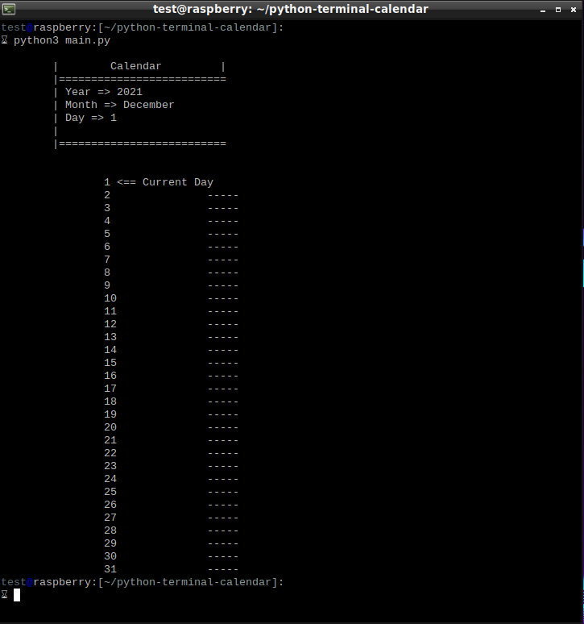

# Python Terminal Calendar.

__See a small calendar with the current date from the terminal.__

__This program not have dependencies, only python3 installed.__

## Run.
```bash
$ python3 main.py
```

__Or:__

```bash
$ python3 -m main
```

## Screenshot.

